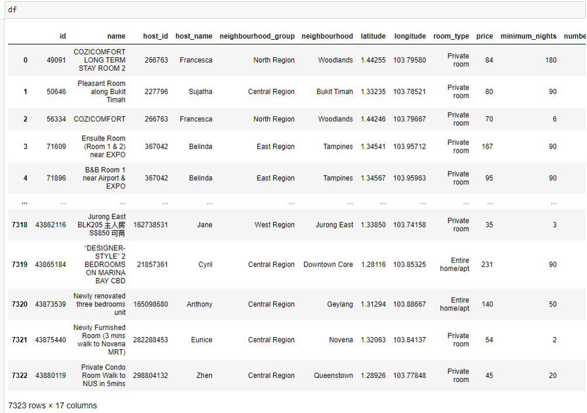
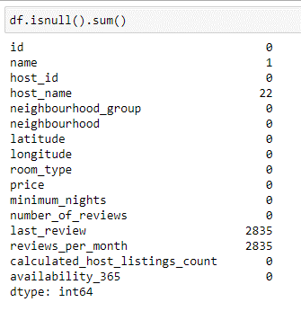
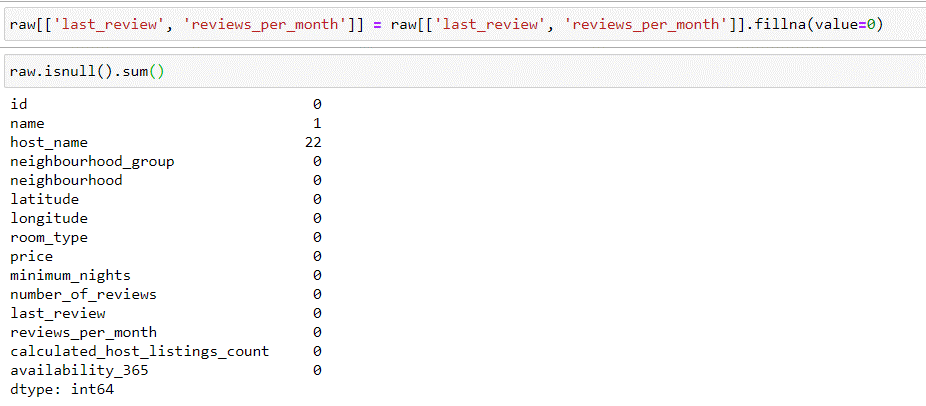
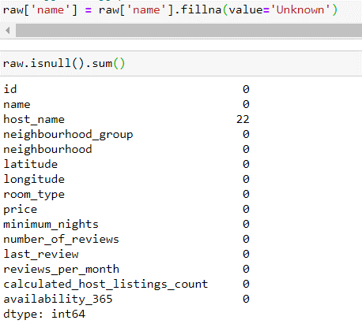
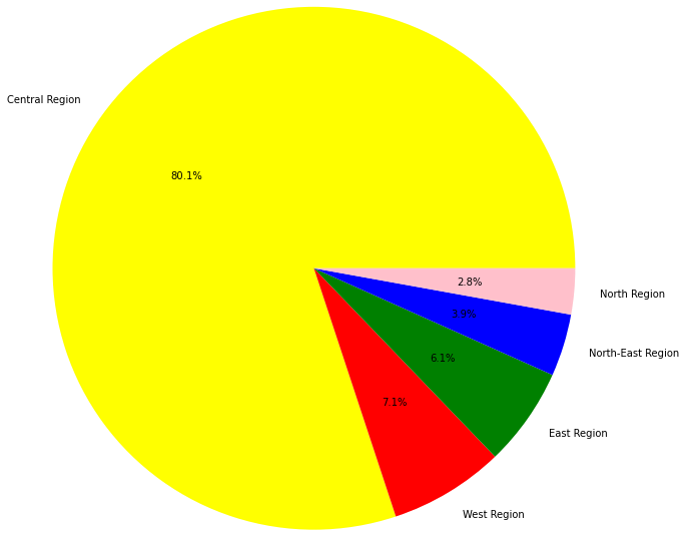
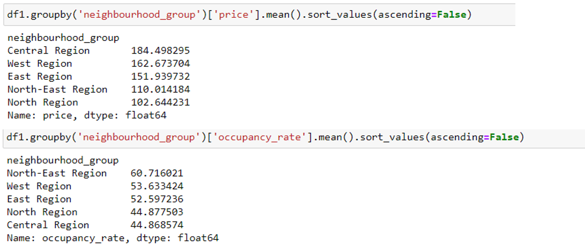
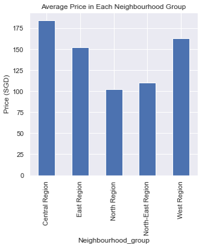
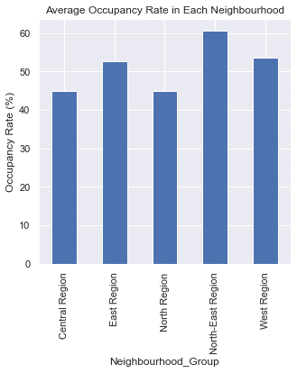
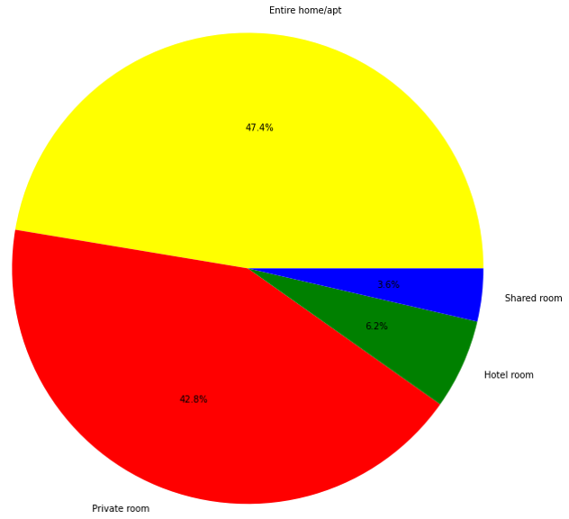
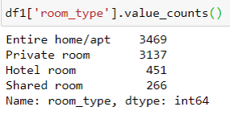

# Exploratory Data Analyst---AirBNB-Singapore

Exploratory Data Analysis AirBNB – Singapore

## Outline of the Analysis
- Define Problems and Goals
- Getting data and Data Cleansing
- Analyzing and getting data insight
- Insight Visualization

## Problem:
Acting as one of AirBNB's Data Scientist, multiple insights are needed to expand our business area.
In that case, few factors have be discovered:
1. Where the most optimal location to make an expansion is.
2. Best estimated price on each location.
3. Which room type have the highest occupancy rate for each location

## Goal:
Exploring data to figure out insights that will help solving defined problem.

Data Source:
•http://insideairbnb.com/get-the-data.html - Singapore - listings.csv

The Data consists of 7323 rows x 15 columns with columns:
- Id, name, host_id, host_name, neighbourhood_group, neighbourhood, latitude, longitude, room_type, price, minimum_nights, number_of_reviews, last_review, reviews_per_month, calculated_host_listings_count, availabity_365 

## DATA CLEANSING

  Handling Missing Value
  
 

- 1 row of missing value in column ‘name’
- 22 rows of missing values in columns ‘host_name
- 2835 rows of missing values from columns ‘last_review’ and ‘reviews_per_month’ 

For the columns ‘last_review’ and ‘reviews_per_month’ we fill the NaN values with 0 (zero).
Because the rows that have NaN values on both columns are the rows the have 0 Number_of_reviews
So we can conclude that with 0 Number_of_reviews there will also be 0 last_review and reviews_per_month

For the missing value in column ‘name’ we fill in the value ‘Unknown’
For the missing value in column ‘host_name’ we fill in the value ‘Classified’

## DATA ANALYSIST

In order to approach to the Analysist,  first thing is determining what are the most critical factors to expand our business area.

4 most important factorsa are needed to be identified, which are:
Neighbourhood_group and Neighbourhood
Price
Occupancy Rate
Room Type

*Neighbourhood_groups and Neighbourhoods gives us basic information about locations in Singapore. By combining data based on their neighbourhood_groups / neighbourhoods we will gain information on which neighbourhood_groups / neighbourhoods should we do an expansion

*Price is very important because usually price determines the occupancy rate of a room, people usually chose the room with the cheapest price.

*Occupancy Rate on the other hand gives insights to us to know in which location of Singapore does AirBNB has the highest occupancy rate, so that location could be the best fitted location to doing an expansion

*Room Type because we want insights on what type of room should we make an expansion on.

The first part of the analysist is tring to find insights from the Neighbourhood_group data. We want to know how is the spread of room in Singapore base on their neighbourhood_groups available in Singapore. To visualize this data Pie chart is used.

According to this pie char, it is to see, that the majority of AirBNB location is in Central Region with 80.1% The amount of all airBNB unit in this area is far beyond any other Regions, which not even 10%. City center, tourist attraction (i.e. Marina Bay Sand, Garden by the bay, and Universal studios), and location of the majority of business district are just a few example, why Central Region is the most favorable Region to stay in Singapore.

Then the next observfation is finding the average Price and Occupancy Rate Percentage of rooms based on their neighbourhood_group, the picture shows python code and results.

Based on the graph is concluded:
Central Region has the highest average price of rooms
North Region has the lowest average price of rooms

Nevertheless this graph shows:
The highest average Occupancy Rate of rooms is at the North-East Region
The lowest average Occupancy Rate of rooms is at the Central Region 

The last part of our analysis is trying to find insights from the Room Type Data. We want to know how is the spread of room_types in Singapore base on their respective types. To visualize this data Pie Chart is being used.

This pie chart shows, that most stay are either entire home/apt or private room, with 47.4% and 42.8%, whereas hotel room and shared room come as 3rd and 4th most favorable respectively, with 6.2% and 3.6%. Most of our partner rent us their entire home, entire apt, or private room, which can be seen via this pie chart.

This code is to check the average of Price and Occupancy rate of each room type based on the whole data.

